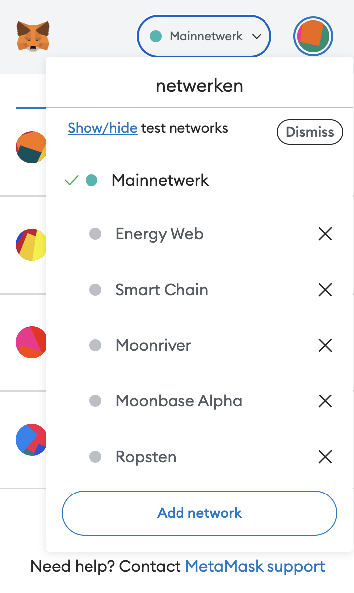
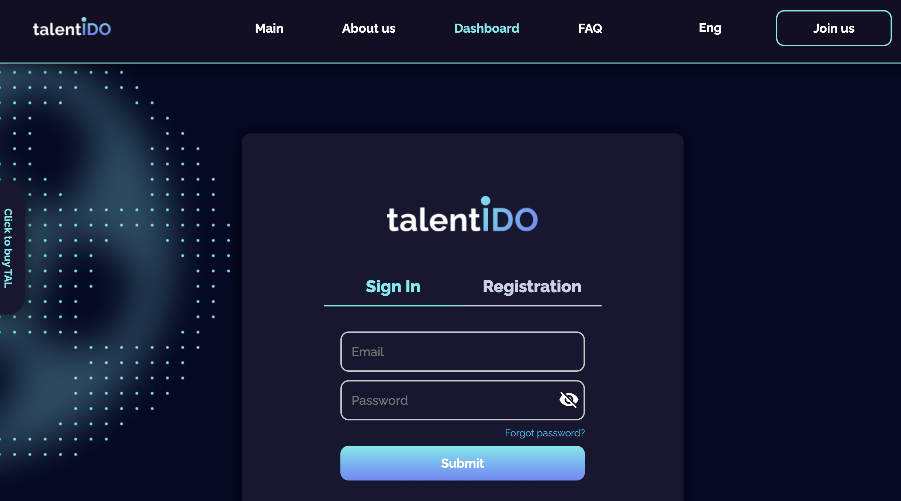
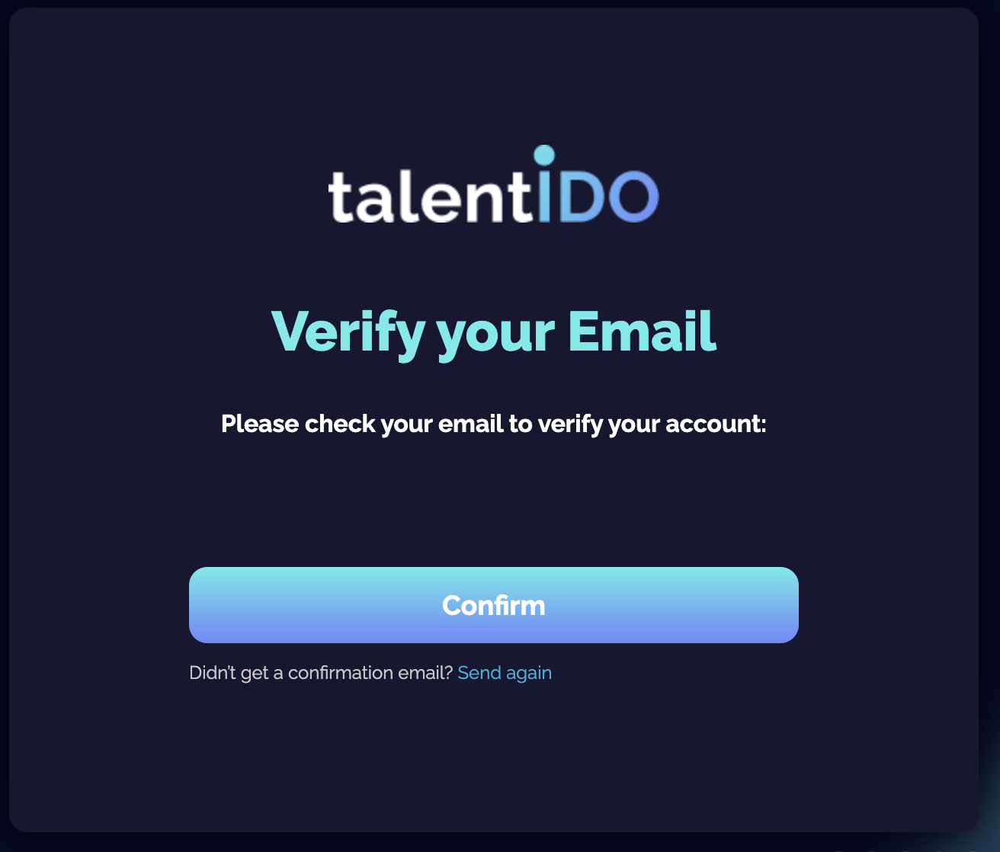
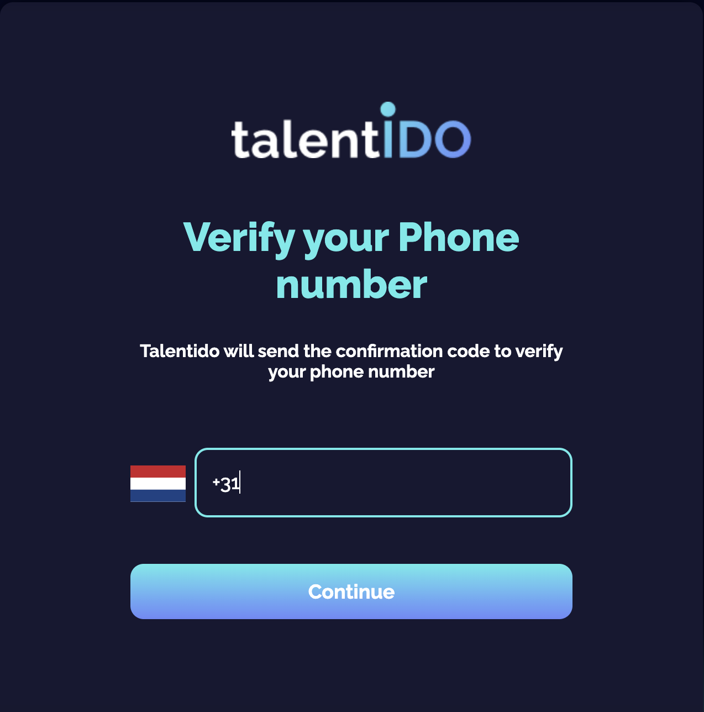
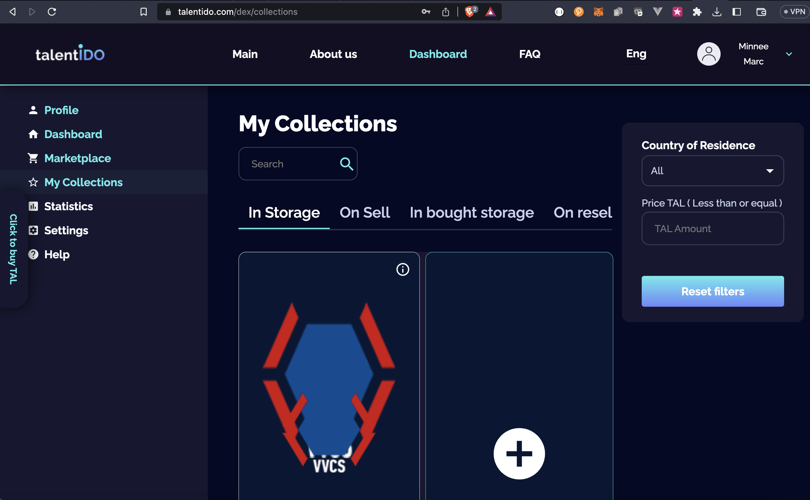
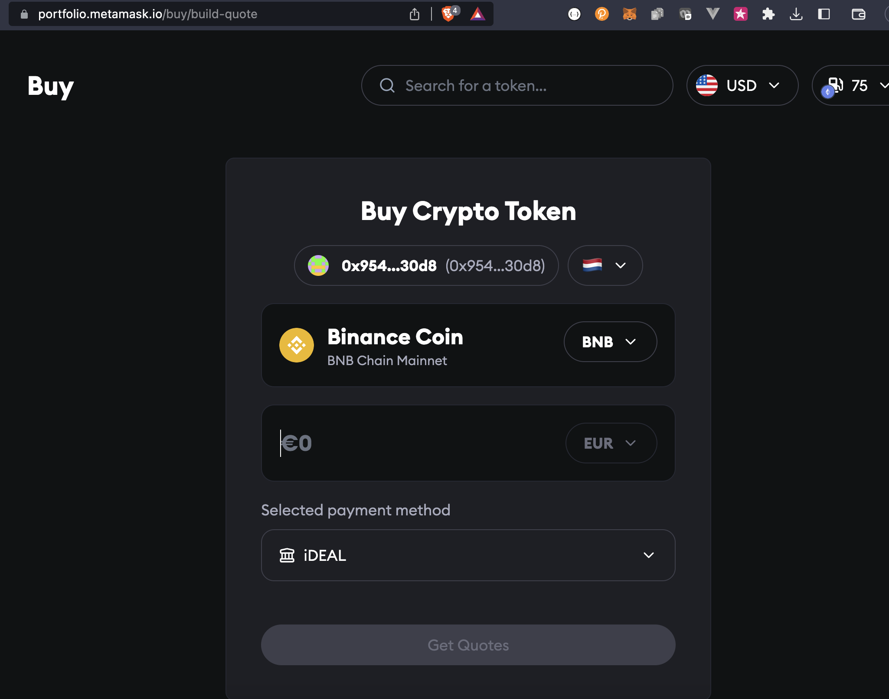
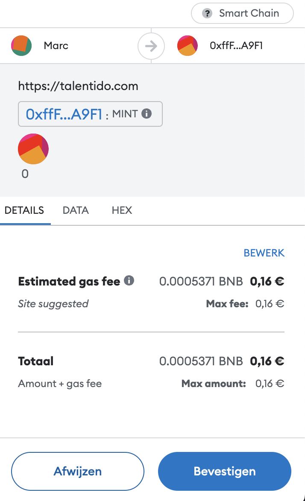
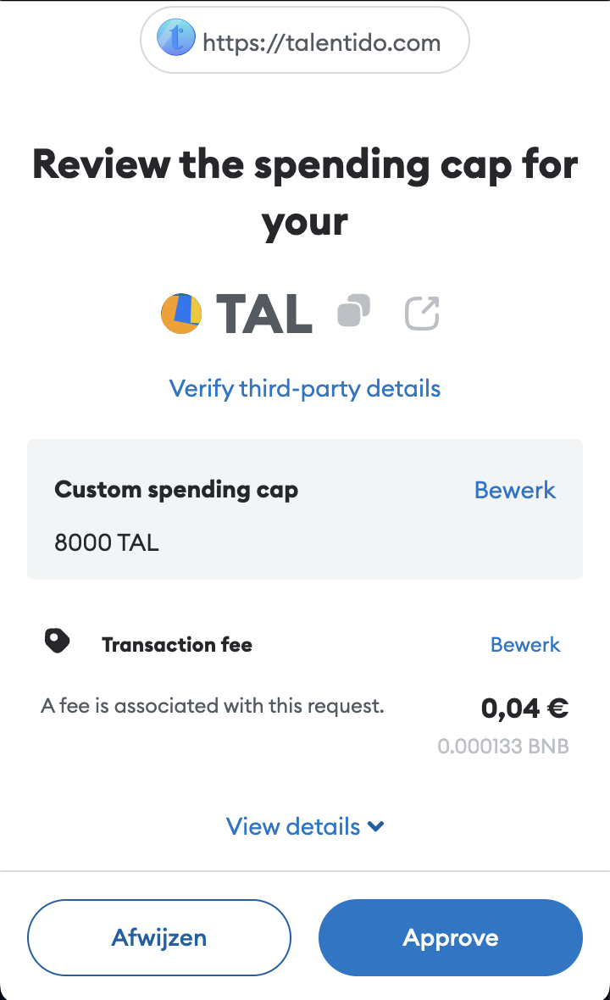
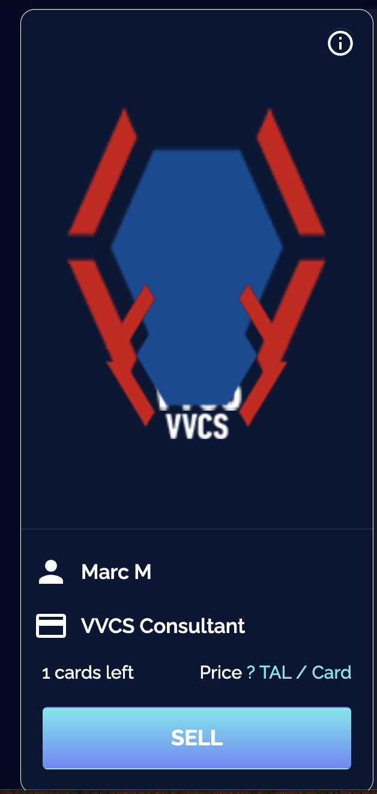

# TalentIDO

[TalentIDO](https://talentido.com/about-us) is een NFT Marktplaats voor sporters om hun talenten te laten zien en een fanbase te onderhouden. Spelers kunnen hier zelf NFTs maken en in de marktplaats zetten. [Hier](https://medium.com/@talentidosocial) is meer informatie.

# NFT

Een Non Fungible Token (NFT) is een uniek digitaal eigendomsbewijs dat specifieke karaktereigenschappen heeft:

* je kan een NFT verhandelen op een marktplaats
* je kan een NFT programmeren zodat bijvoorbeeld een percentage van de opbrengst naar een bepaald doel gaat
* je kan een NFT ook in delen verhandelen
* je kan bezitters van een door jou uitgegeven NFT bepaalde voordelen geven (om je fanbase te onderhouden)

Voor meer informatie over NFTs, kijk [hier](https://www.crypto-insiders.nl/academy/wat-zijn-non-fungible-tokens-nft/).

# Opstarten

Om gebruik te maken van de NFT Marktplaats heeft VVCS een contract afgesloten met TalentIDO. Daarvoor moet je je eerst op de website van TalentIDO aanmelden als speler. Dat gaat het makkelijkst als je een aantal zaken hebt voorbereid:

* je hebt een laptop of een PC tot je beschikking
* je hebt een crypto-wallet zoals [MetaMask](https://metamask.io/) of [WalletConnect](https://walletconnect.com/) geinstalleerd
* je hebt je ID kaart of rijbewijs bij de hand (voor de registratie van jou als persoon)

## Laptop of PC

Hoewel je ook met een smartphone NFTs kan verhandelen gaat het in het begin het makkelijkst met een laptop of PC, dan kan je ook makkelijk je wallet verbinden met de TalentIDO marktplaats, wat een voorwaarde is om te kunnen handelen.

## Wallet

Een crypto-wallet is een essentieel stuk gereedschap voor het handelen in NFTs. In feite is het een digitale portemonnee waarin je zowel crypto-valuta (BTC, ETH etc.) bewaart als NFTs. Met crypto-valuta betaal je voor transacties op het TalentIDO platform, en dat gebeurt ook in een eigen (fungible) token de TAL. Als je een NFT verkoopt ontvang je ook weer TAL tokens.

Nadat je de wallet hebt geïnstalleerd moet je verbinding maken met de [Binance Smart Chain](https://www.bnbchain.org/en/smartChain), dat is een specifieke blockchain waar TalentIDO zijn transacties op doet. Hoe doe je dat?

1. Ga in MetaMask naar Netwerken, bovenaan een dropdown box, en klik op `Add network `

   
2. Volg de instructies in dit [artikel](https://academy.binance.com/en/articles/connecting-metamask-to-binance-smart-chain)
3. Belangrijk is dat je in de vorige stap de RPC URL goed hebt ingevuld, dat is dus https://bsc-dataseed.binance.org/. Als het goed is volgt de rest dan vanzelf en kan je met je wallet connectie maken met de Binance Smart Chain
4. Zorg ervoor dat je een backup maakt van je wallet door de getoonde 12 woorden (pass phrase) ergens op te schrijven en goed te bewaren (niet in de cloud....)

## Registreren en inloggen

Voordat je gebruik kan maken van de marktplaats en je wallet daarmee kan verbinden moet je registreren. Dat is een vrij omslachtig KYC (Know Your Customer) proces, verplicht voor dit soort platformen die crypto verhandelen. Het begint met de registratie van een emailadres en password zoals gebruikelijk, als je op `Join us` klikt:

Volg het proces en bevestig je emailadres, daarna klik je op de knop `Confirm`

Daarna wordt om je mobiele nummer gevraagd, belangrijk voor de verdere communicatie:

Zorg dat je het landnummer wijzigt naar +31 en dan je mobiele nummer zonder de 0 intypen. Vervolgens wordt je naar een KYC proces geleid, waarbij je een foto van jezelf moet maken. Doe dit via je telefoon en houd je ID kaart of rijbewijs bij de hand, daar moet je ook een foto van maken. Volg het proces stap voor stap en uiteindelijk ben je dan geregistreerd en kan je je wallet met de website verbinden.

# NFTs maken

Het idee van een NFT marktplaats is natuurlijk om NFTs te verhandelen. TalentIDO stelt je in staat om zelf een NFT te maken en op het platform te verhandelen. Nadat je bent ingelogd kom je op een overzichtpagina van je profiel of ga naar `Dashboard`. Klik dan op `My Collections`:

In bovenstaand plaatje is al een voorbeeld NFT aangemaakt, door op de plus te klikken kan je een NFT aanmaken met je eigen foto en een handtekening. Dan komt de NFT in status `In Storage` te staan en `pending`. 

## Minten

Zodra de NFT is goedgekeurd kan je hem *minten*, dat is het proces om de NFT op de blockchain vast te leggen zodat je hem kan verkopen. Zorg dat je voor een klein bedrag ( zeg €20 ) ook de crypto-valuta BNB (Binance Coin) koopt via MetaMask en iDEAL of Creditcard. Dat kan vanuit de wallet door op `Buy` te klikken en dan je wallet adres te koppelen, dat ziet er zo uit:

## Transacties op de chain

Je hebt vanuit de vorige stap een beetje BNB nodig om de transacties via de blockchain af te kunnen handelen voor de zogenaamde *gasfee*, het bedrag voor een transactie op de infrastructuur. Je zal merken dat je een aantal transacties met contracten moet goedkeuren om de NFT uiteindelijk in de etalage te krijgen. Dat ziet er ongeveer zo uit, in werkelijkheid zie je dit soort bevestigingeneen paar keer voorbij komen:

Uiteindelijk kan je dan je NFT gaan verkopen, dan ziet je kaartje er zo uit:

